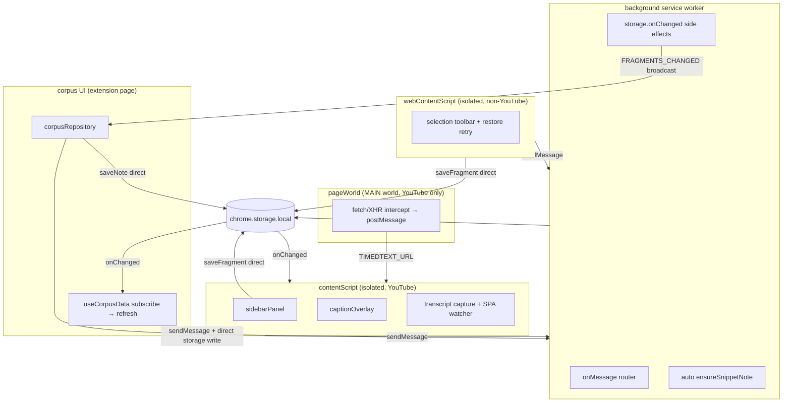

# Project Semia — Chrome Extension Architecture Review

**Date:** 2026-08-01  
**Goal:** Help agents find root causes faster in the Chrome extension environment.  
**Scope:** `apps/extension` + `apps/corpus` integration layer.

For day-to-day bug triage, use the condensed playbook: `docs/agents/debugging.md`.

---

## 1. System map



**Agent trap:** Fixing only `background.ts` misses writes from content scripts and
corpus direct storage access.

---

## 2. High-risk patterns

### 2.1 Storage reactive cascade

`apps/extension/src/background.ts` listens to `chrome.storage.onChanged`:

- On `FRAGMENTS_STORAGE_KEY` change → `generateNotesForNewFragments` → `saveSnippetNote`
- On fragments or snippet notes change → broadcast `FRAGMENTS_CHANGED`

`apps/corpus/src/hooks/useCorpusData.ts` subscribes and calls full `refresh()` on
every notification (fragments + transcripts + snippet notes).

### 2.2 Write-on-read: LIST_TRANSCRIPTS

`background.ts` handler for `LIST_TRANSCRIPTS` enriches via oembed and may call
`saveTranscript` during a read. Corpus `refresh()` calls this on every storage event.

### 2.3 Dual write paths

| Operation | Write path |
|-----------|------------|
| YouTube capture | `sidebarPanel` → `storage.saveFragment` (content script) |
| Web capture | `webContentScript` → `storage.saveFragment` (content script) |
| Corpus user notes | `corpusRepository.saveNote` → direct `chrome.storage.local.set` |
| AI snippet notes | background `saveSnippetNote` |
| Transcripts | content `SAVE_TRANSCRIPT` message or background `saveTranscript` |

Documented in `issues.md`: web capture does not go through background.

### 2.4 Polling and retries

- `contentScript.ts`: `setInterval(check, 800)` for YouTube SPA navigation
- `captionOverlay.ts`: 1s interval to re-attach overlay to player DOM
- `webContentScript.ts`: restore retry up to 20×500ms

### 2.5 Silent degradation

`buildWebFragment` / `buildWebAnchor` save fragments even when offset location fails.
Anchor falls back to `textQuote.exact` with placeholder `textPosition`. Jump-back and
AI context can fail while capture appears successful.

---

## 3. Test coverage gap

| Tested (pure functions) | Untested (where bugs live) |
|-------------------------|----------------------------|
| `flattenText`, `restoreWebSelection`, parsers | `background.ts` message routing |
| `youtubePageMeta`, `contextWindow` | `storage.onChanged` chains |
| | `corpusRepository.subscribe` dual listeners |
| | Content script lifecycle / SPA |
| | `pageWorld` ↔ content script bridge |

---

## 4. Deepening candidates

### Candidate #1 — Unified storage command bus

**Strength: Strong**

| | |
|---|---|
| **Files** | `background.ts`, `storage.ts`, `fragmentsStorage.ts`, `snippetNotesStorage.ts`, `corpusRepository.ts`, `contentScript.ts`, `webContentScript.ts`, `sidebarPanel.ts` |
| **Problem** | Writes scattered across three contexts; no single interface; agents cannot infer all side effects from one module |
| **Solution** | All mutations via background messages; content scripts send commands only; background is the sole `chrome.storage.local.set` writer for domain keys |
| **Benefits** | Locality, leverage (logging, dedup, transactions at one seam), testable message bus |

### Candidate #2 — Reactive graph module (break refresh loops)

**Strength: Strong**

| | |
|---|---|
| **Files** | `background.ts` onChanged, `corpusRepository.subscribe`, `useCorpusData`, `useCorpusNote` |
| **Problem** | `FRAGMENTS_CHANGED` + `storage.onChanged` double notify; full refresh on every event; `LIST_TRANSCRIPTS` write side effect |
| **Solution** | (a) Single notification channel; (b) incremental refresh; (c) oembed enrichment as background scheduled job, not on LIST |
| **Benefits** | Eliminates most “infinite refresh” reports; finite state machine for agents |

### Candidate #3 — Deepen web capture module

**Strength: Strong**

| | |
|---|---|
| **Files** | `web/buildWebFragment.ts`, `flattenText.ts`, `buildWebAnchor.ts`, `restoreWebSelection.ts`, `webContentScript.ts` |
| **Problem** | Shallow module; locate / anchor / restore diverge; silent failure; `findFlatRange` first-match only |
| **Solution** | Single `WebSelectionModule` with `confidence` + `failureReason`; no silent save on locate failure; shared flatten strategy for capture and restore |
| **Benefits** | Agents see degraded quality explicitly; builds on existing unit tests |

### Candidate #4 — Thin background router

**Strength: Worth exploring**

| | |
|---|---|
| **Files** | `background.ts` |
| **Problem** | Router + storage listener + AI orchestration in one file; cross-triggering |
| **Solution** | `messageRouter.ts` + `fragmentPipeline.ts` + `transcriptPipeline.ts` |
| **Benefits** | Each pipeline testable in isolation |

### Candidate #5 — Agent debug contract (documentation)

**Strength: Strong (zero code)**

Implemented as `docs/agents/debugging.md` — symptom playbook, storage keys, message
protocol, false assumptions list.

### Candidate #6 — YouTube subsystem boundary

**Strength: Worth exploring**

| | |
|---|---|
| **Files** | `pageWorld.ts`, `contentScript.ts`, `captionOverlay.ts`, `playerSync.ts`, `youtubePageMeta.ts` |
| **Problem** | MAIN/isolated dual world + multiple polls; meta refresh and transcript capture interleave storage writes |
| **Solution** | `YoutubeCaptureModule` with narrow public interface (`setActiveVideo`, `getTranscript`) |

---

## 5. Mapping to issues.md

| issues.md item | Candidate |
|----------------|-----------|
| webContentScript race (`removeToolbar` timeout) | #3 + debugging playbook |
| `findFlatRange` first match only | #3 |
| Silent offset failure | #3 |
| Web capture bypasses background | #1 |

---

## 6. Phased execution plan

```
Phase 0 — Documentation (done)
  docs/agents/debugging.md
  docs/architecture-review-2026-08.md

Phase 1 — Break refresh loops
  Remove write-on-read from LIST_TRANSCRIPTS
  Move oembed enrichment to background scheduled/one-shot job
  Evaluate merging FRAGMENTS_CHANGED + storage onChanged notify paths

Phase 2 — Unified storage bus
  Route all domain storage writes through background

Phase 3 — Web capture failure visibility
  confidence / failureReason on anchors; no silent degraded save

Phase 4 — Background pipeline split
  messageRouter + fragmentPipeline + transcriptPipeline
```

**Why Phase 1 before Phase 2:** Phase 1 stops the most common refresh loops with
smaller diff; Phase 2 is the structural fix but touches more call sites.

---

## 7. Top recommendation

**Start with Candidate #2 (Phase 1)** — reactive graph / write-on-read — then **Candidate
#1 (Phase 2)** — unified storage seam.

---

## 8. Agent prompts

### Bug-fix session (symptom-driven)

```
I'm fixing Project Semia Chrome extension: [symptom].

Read first:
1. docs/agents/debugging.md
2. apps/extension/src/types.ts
3. apps/extension/src/background.ts

Assume storage writes may come from content script, background, or corpus.
LIST_TRANSCRIPTS can write during read. Trace chrome.storage.onChanged before patching React.

Before fix: data-flow diagram with loop edge marked.
After fix: npm run verify + manual smoke steps.
```

### Phase 1 (architecture)

```
Execute architecture review Phase 1 (docs/architecture-review-2026-08.md):
- Remove write-on-read from LIST_TRANSCRIPTS; move oembed enrichment off the read path
- Evaluate merging FRAGMENTS_CHANGED and storage onChanged double notification
Write a short spec before code. npm run verify when done.
```
